# 🌊 Building Streaming Data Pipeline with Data Lakehouse

<p align="center">
  
  
  
  
  
  
</p>

Xây dựng luồng xử lý dữ liệu thời gian thực (Real-time Streaming Pipeline) với **Apache Flink**, lưu trữ dữ liệu với kiến trúc định dạng **Data Lakehouse** thông qua nền tảng **Iceberg**, tương tác truy vấn qua **Trino** và dịch vụ lưu trữ Object Storage bằng **MinIO**.

---

## 🏛️ Kiến trúc hệ thống (High-Level System Architecture)
Kiến trúc tổng quan mô tả dòng dữ liệu từ khi sinh ra tại Source, truyền qua Kafka broker, được xử lý Streaming bởi Flink và lưu trữ phân lớp xuống Data Lakehouse.

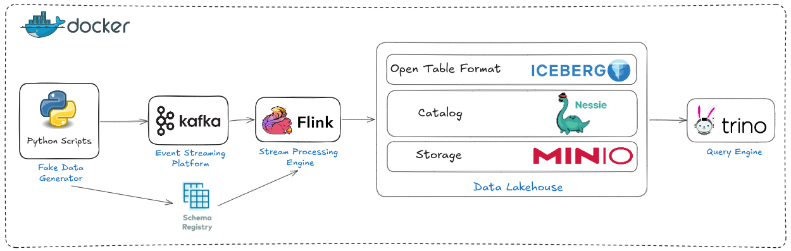

## 🔄 Logic xử lý luồng (Data Transformation Logic)
Mô hình diễn giải chi tiết các quá trình biến đổi dữ liệu sử  dụng các kĩ thuật Join, Window Aggregation bằng Flink SQL & Table API.

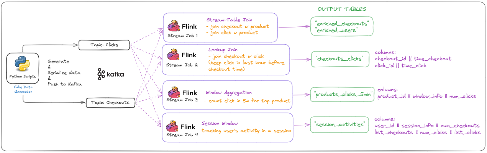

---

## 🚀 Tính năng chính (Key Features)

- **Real-time Data Processing**: Xử lý luồng dữ liệu Event-driven tốc độ cao với độ trễ thấp bằng Apache Flink.
- **Data Enrichment**: Làm giàu dữ liệu tĩnh chứa (User, Product) trong PostgreSQL kết hợp với luồng dữ liệu liên tục trong Kafka.
- **Stream-to-Stream Join**: Kết nối hai luồng thông tin rời rạc Clicks và Checkouts để thiết lập mối quan hệ theo khung thời gian (Interval Join).
- **Window & Session Aggregation**: Gom nhóm dữ liệu và tạo báo cáo trực tiếp trong từng khoảng thời gian (Tumbling Windows) hoặc theo mốc hoạt động của người dùng (Session Windows).
- **Data Lakehouse Architecture**: Lưu trữ định dạng bảng Iceberg vào MinIO (với Nessie làm Catalog) giúp đảm bảo tính ACID và sẵn sàng cho các engine đọc nhanh như Trino.

---

## 🛠️ Hướng dẫn cài đặt và chạy dự án (Getting Started)

### 1. Khởi động hạ tầng hệ thống (Infrastructure)

Khởi động toàn bộ các thành phần hạ tầng thông qua Docker Compose (bao gồm Kafka, Flink, MinIO, Trino, v.v.):

```bash
make up
```
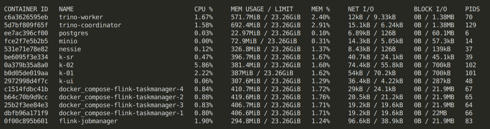

> **⚠️ LƯU Ý QUAN TRỌNG:** Để có đủ **Task Slots** cho các Flink Job chạy song song mà không bị kẹt, hệ thống cần được khởi chạy với số lượng Task Manager tối thiểu từ 4 trở lên (Đã cấu hình sẵn `--scale flink-taskmanager=4` trong file `Makefile`).

**Kết quả thành công:**
- Bucket gốc lưu data tại MinIO được cấp phát sẵn một cách tự động.
  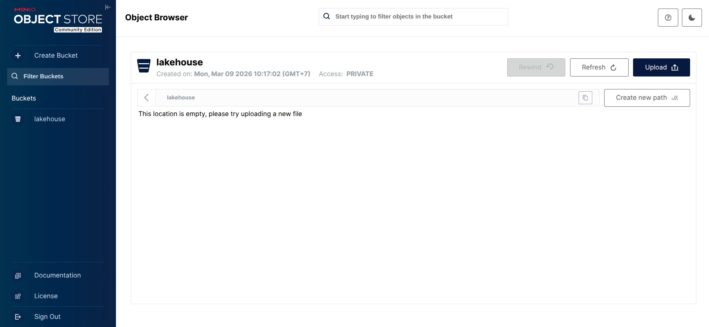
- Các cấu phần Task Manager đăng ký và nhận kết nối thành công với Job Manager.
  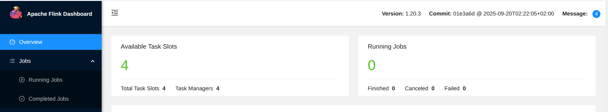

### 2. Khởi động giả lập dữ liệu (Source Data Generator)

Sản sinh luồng dữ liệu sự kiện theo thời gian thực để tiến hành giả lập hệ thống:

```bash
make setup_source
```

**Kết quả thành công:**
- Các bản ghi dữ liệu được đẩy thành công vào các Topic tương ứng trên Kafka. Các bản ghi này được tuần tự hóa theo dạng Avro để giảm tài nguyên cần thiết để lưu trữ.
  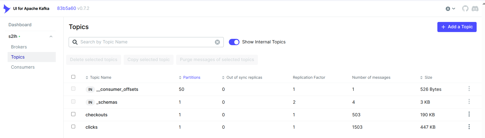
- Cấu trúc lược đồ (Avro schema) được tải lên và lưu trữ thành công trên Schema Registry. Các lược đồ này được sử dụng bởi Flink để giải tuần tự hóa dữ liệu. Schema Registry cũng hỗ trợ Schema Evolution, hạn chế lỗi khi Data Source thay đổi Schema.
  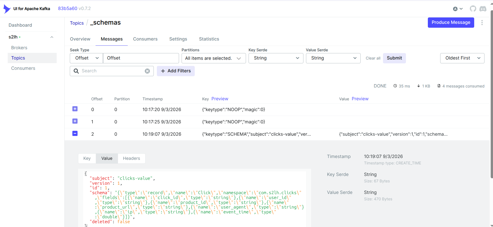

### 3. Đệ trình tiến trình xử lý tính toán (Submit Flink Jobs)

Tiến hành đệ trình (`submit`) các Flink Streaming Jobs vào hệ thống cluster Flink:

```bash
make jobs
```

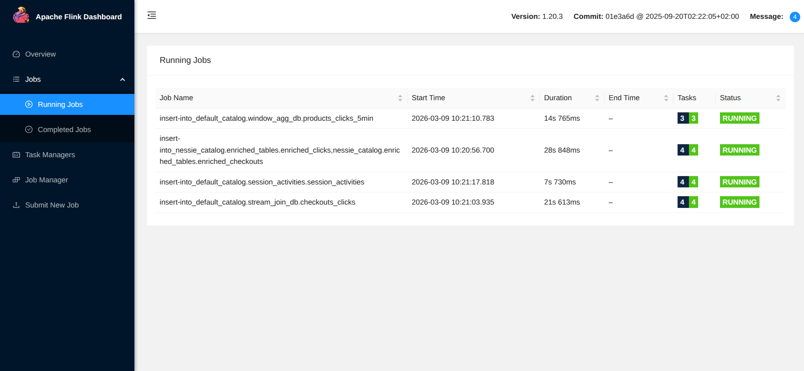

Khi Jobs chuyển sang trạng thái `RUNNING`, hệ thống sẽ liên tục đọc sự kiện Kafka và xử lý qua toán tử (operators) theo kiến trúc bên trên, kết xuất dữ liệu và được ghi theo định dạng Parquet/Iceberg tại MinIO (Storage của Data LakeHouse):

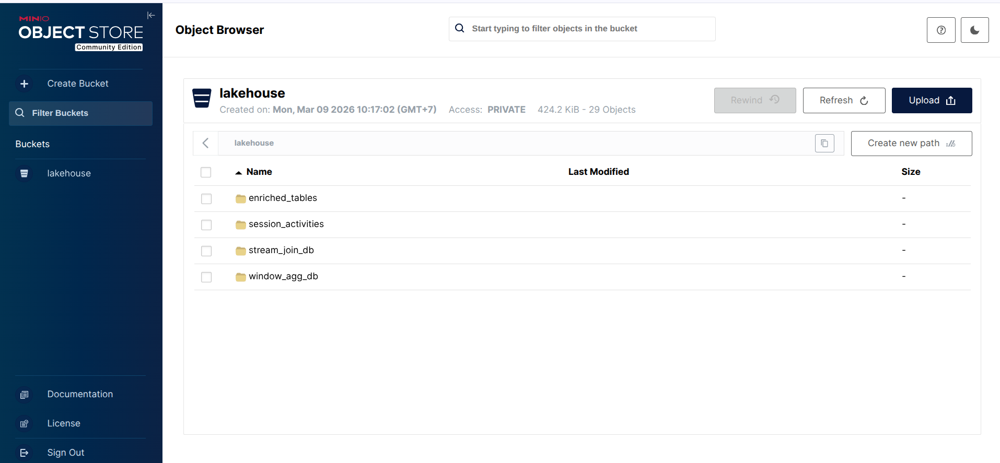

---

## 📊 Truy vấn Lakehouse (Validation & Querying)

Với **Trino**, hệ thống cho phép Data Analysts và Data Scientists có thể tận dụng kiến thức SQL cơ bản để truy xuất, kiểm chứng và phân tích dữ liệu trực tiếp từ Data Lakehouse.

**Bảng Enriched Checkouts:**
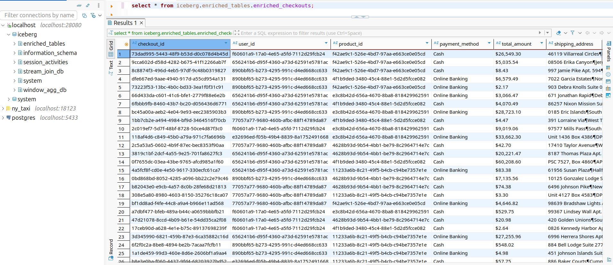

**Bảng Enriched Clicks:**
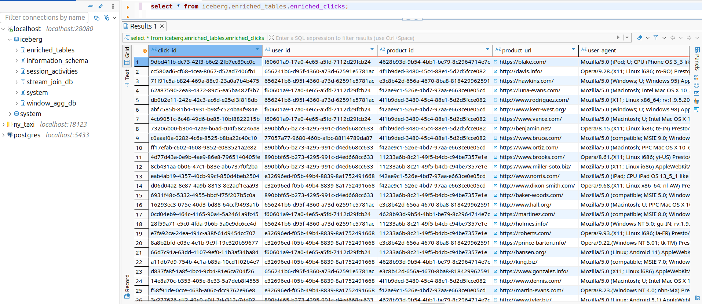

**Bảng thống kê hoạt động Window Aggregation (5 phút):**
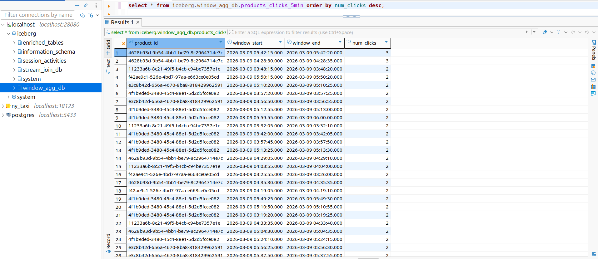

**Bảng gộp Stream Join phân tích chuyển đổi Hành động:**
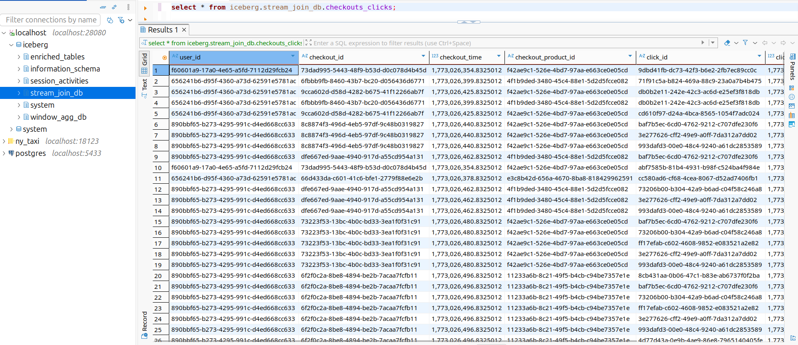

**Mô hình hóa dữ liệu Phiên người dùng (Session Aggregation):**
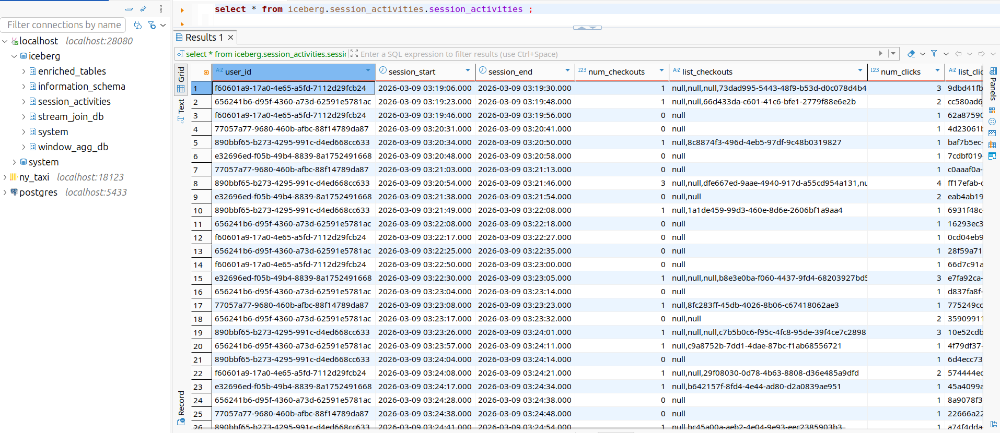

---
<div align="center">
  <sub>Dương Vũ Hoàng</sub>
</div>
